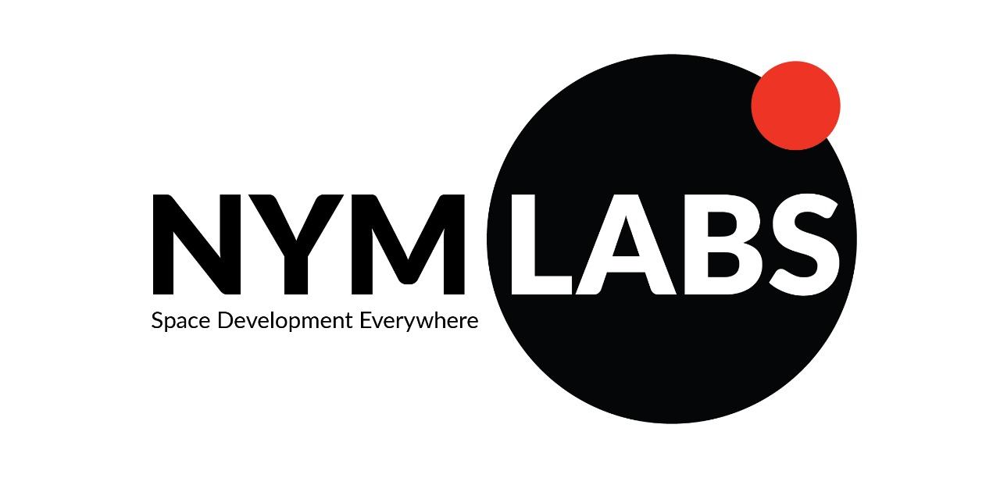

# NYMLABS
_**Space Development Everywhere**_

 
 

Great advances in space technology are often connected to later improvements in other sectors of the economy. Small and medium-sized startups play a fundamental role in the transfer of all these technologies to the economic branches of daily life. However, in Latin America, the absence of space agencies in most countries added to the lack of integration of project’s databases translates into a weak rate of emergence of new ventures.

NymLabs finds collaborative work and visibility as boosters of new developments. Consequently, it is proposed a “Social network for projects” that allows to show and interact with other developments, while offering useful tools for the growth of projects.

## Table of Contents
<!--ts-->
   * [Description of the Problem](#description-of-the-problem)
   * [Solution](#solution-brief)
      * [Projects](#projects)
      * [Feed](#feed)
      * [Services cataloge](#services)
        * [Local Services]
      * [Help material](#material)
      * [My account](#my-account)
   * [Impact](#impact)
<!--te-->
