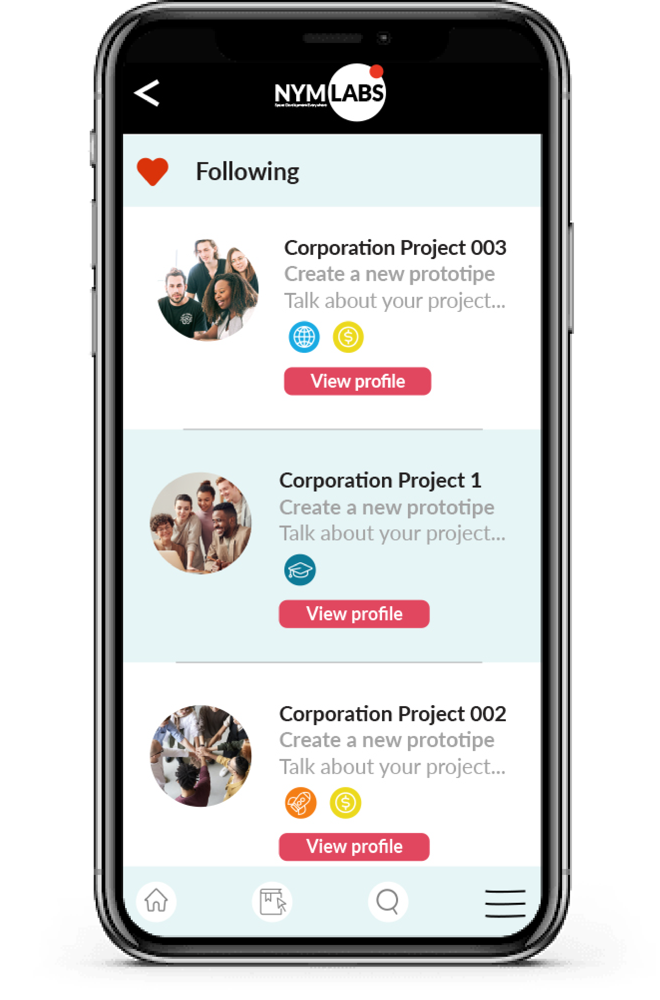

# NYMLABS
_**Space Development Everywhere**_

 
 

NymLabs is a web-app that aims to boost the emergence of new space technology ventures from promoting collaborative work and visibility of space projects in addition to the access to local and international resources and services. 
Any person or organization interested in developing, collaborating, or enrolling in a project could create an account and either add a new project or request to work on another project. All the projects will be visible and categorized in web-app. The users could follow all the projects or tags of their interest. Project leaders looking to onboard new people could access selected user profiles that fit the project requirements.  Project members will have access to a service catalog, where they can find local services, large-scale services, and support content. Local businesses could display their services through catalog services. Large services and resources, such as NASA Open Data Sets or AWS Cloud Platforms, will also show up in the Service Catalog.

## Table of Contents
<!--ts-->
   * [Description of the Problem](#description-of-the-problem)
   * [Solution](#solution)
      * [Projects](#projects)
      * [Feed](#feed)
        * [Following](#following)
        * [General Feed](#general-feed)
      * [Services catalog](#services-catalog)
        * [Local Resources](#local-resources)
        * [Technology Resources](#technology-resources)
        * [support content](#support-content)
      * [My account](#my-account)
   * [Impact](#impact)
   * [The Team](#the-team)
   * [References](#references)
<!--te-->

## Description of the problem

Great advances in space technology are often connected to later improvements in other sectors of the economy. Small and medium-sized startups play a fundamental role in the transfer of all these technologies to the economic branches of daily life. However, in Latin America, the absence of space agencies in most countries added to the lack of integration of project’s databases translates into a weak rate of new startups. Some groups and organizations try to narrow this disconnection gap through the realization of divulgation events such as the “Bootcamp Colombia, A Mission to Mars” and the “Argentine Congress of Space Technology”. Nevertheless, although these kinds of events have a real impact on the disclosure of the space field, they are not a permanent tool for visibility and collaborative work within projects.

## SOLUTION

The platform is intended to be used by independent researchers, research groups, startups, companies, educational institutions, professionals, environmental protection agencies, and many others. People would start by creating a personal account, in which person account users can create and manage organization and project accounts, generate participation requests, track projects of interest, and access a personalized service catalog. As a result of these facilities, collaborative work within the projects and their visibility will be promoted, as well as the strengthening of existing companies that provide services and products.

 

The web-app is divided into 4 sections, Projects, Feed, Services Catalog and My account. Each one of these sections are described in detail below.

### Projects

Every project created in the platform counts with a defined structure. This structure is composed by:

- Title
- Brief description
- Type of Project (Academic, Startup, Business)
- Responsable(s)
- Indicate if it is looking to onboard new people
- If they are looking for members, indicate type of enrollment (paid or voluntary)
- Tags

In order to specify the type of project, if they are looking to onboard new people and if the kind of enrollment, we use the following 5 symbols. 

 

The users could filter their searches by those 5 symbols. We also use a tag system to make filtering by topics. These tags are provided by the creator of the project profile.

 

This section shows a list with all the projects and their basic information in a card format. By clicking on the project of interest, all the data shown above is displayed. Additionally, the user could start following any project of their interest just by clicking on the follow button.

 

### Feed

Keeping track of projects, organizations, and topics of interest is a necessary tool to achieve continuous new collaborations and the emergence of new projects. This section has two ways to keep the user informed about updates and new releases. One way, called "Following", shows updates related to the projects and the organization that the user follows, while the other view, called "General feed", shows the projects and organizations recommended to users based on their interests, along with relevant data about international organizations such as space agencies and programs.

#### Following

As mentioned earlier this subsection shows the projects the user is subscribed to. It shows the activities and updates made by the other members of the projects. The way in which this activity is displayed is through a list of projects where the order is defined by the project activity and the interest shown by the user in each project. In this way, users can continue to review projects that interest them more quickly.

 

#### General Feed

All projects with tags similar to the projects you follow, each new project from an organization you already follow, and the latest releases from space agencies and programs related to your interest will be displayed here. This will allow the user to explore new projects and news in a more efficient and personalized way.

 

### Services Catalog

This section is divided into 3 main subsections, Local Resources, Technology Resources and Support Content. 

#### Local Resources

In this subsection is presented all the services our local partners share to give you a better working experience having an integral and connected environment. Here you can see people who offer their services in your country or near your place, some companies working in subjects such as PCB design and mechanical manufacturing could give a hand!

From the point of view of the business, they have the chance to offer all their services and products to hundreds of projects through this subsection. Consequently, the growth will not be just for the new startups but also for the existing industry.

 

#### Technology Resources

In this section the user can find relevant information (Plans, prices, descriptions, comparatives) about global services suchs as Open Datasets from NASA; AWS Cloud Platforms or task management apps. In the Support Content subsection the users can get some additional info about how to use the data and tools they can find here.

 

#### Support Content

This section was designed to locate useful information and links. This information is verified and arranged by the NymLabs team. The data is categorized by topics and type of data. 

Initially are considered 3 main topics, Startups Development, Dataset Management and Academic Content. Moreover, it’s created a Community Content section, addressed to receive posts with useful information from the users. 

It should be mentioned that the content shown in these sections does not belong to NymLabs, it corresponds to official external third parties.

##### StartUp Development

Here, the users can find tutorials and courses related to all they could need to know to start their  space business. 

##### Dataset Management

Here you could find content to learn to access and use different kinds of datasets. 

##### Academic content

This subsection correspond to verified content to learn technical and scientific topics that would help you in your space project.

##### Community content

This content is uploaded by the community. This is an excellent opportunity for those users who create tutorials and material of interest for the space community.
All the content posted here is briefly filtered. Nevertheless, all these posts are taken into account to be verified in order to arrange it in the categorized sections.

 

### My Account

This section is a configuration section. Shows information related to users, such as profiles and professional interests regarding a branch of research or development, registered projects, etc. Also from here users can create and edit their projects and organizations. Also, they can check the status of their applications to other projects from this window.

 

## IMPACT

This platform improves communication and connection between high level companies, low level companies and space enthusiasts making it easier to join efforts to get more impactful and wider developments that can be appreciated by bigger companies, institutions and gubernamental entities.

## THE TEAM

FOTO DE TODOS

## REFERENCES
a

